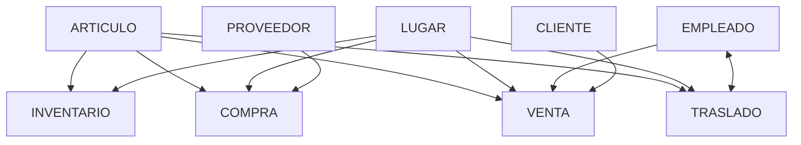

# Carga de datos en la base de datos distribuida de una cadena de tiendas de abarrotes. (Documentación)

En este repositorio se concentraran todos los documentos de los distintos sistemas (unicamente documentacion, no codigo, la documentación puede incluir trozos de codigo indispensables para el entendimiento de esta).

## ¿De que va el proyecto?
Se realizará el diseño de un sistema de información ERP (Enterprise Resource Planning) de una cadena de tienda de abarrotes. Crear el modelo lógico y físico de bases de datos distribuidas.

## ¿Cómo funciona una cadena de tienda de abarrotes?

Las tiendas de abarrotes son pequeños o medianos negocios que ofrecen una gran variedad de productos de primera necesidad; desde alimentos hasta productos de limpieza, e incluso, hay algunas que tienen disponibilidad de productos de salchichonería y bebidas alcohólicas1.

Colocandonos en el contexto proporcionado por el proyecto 
>El sistema es un ERP de una empresa de tiendas de abarrotes la cual tiene 4 sucursalesen la ciudad (Sucursal Lerma, Zinacantepec, Toluca centro y Metepec). El desarrollo debe ser un sistema integral donde se incluyan todas las áreas y los procesos de negocio de la empresa (ventas, control de inventarios, entrega de productos, finanzas, facturación, recursos humanos). No necesariamente en alguna de las sucursales estarán las bases de datos 2

obtenemos una guia para nuestra investigación, a continuación analizaremos los distintos puntos tocados en la cita anterior

### Inventario
El inventario es el conjunto de artículos o materiales que un negocio tiene la intención de vender a los clientes con fines lucrativos. 

La gestión de inventario, un elemento crítico de la cadena de suministro, es el seguimiento del inventario desde el momento de su fabricación hasta los almacenes, y desde estas instalaciones hasta el punto de venta. 

El objetivo de la gestión de inventario es tener los productos correctos en el lugar adecuado y en el momento preciso. Esto requiere visibilidad de inventario: saber cuándo se debe hacer los pedidos, cuánto se debe pedir y dónde almacenar las existencias.

- Compra de inventario: los productos listos para la venta se compran y se entregan en el almacén o directamente en el punto de venta.
- Almacenamiento de inventario: el inventario se almacena hasta que se necesita. Los bienes o materiales se transfieren a través de su red, y hasta que estén listos para su envío.
- Beneficio del inventario: Se controla la cantidad de producto a la venta. Las mercancías acabadas son liberadas para tramitar los pedidos. Los productos son enviados a los clientes.

Dentro del inventario encontramos muchas entidades relacionadas, cómo `articulo`, `lugar`, `inventario`,`movimiento`, `cliente`, `empleado`, y `proveedor`

## Referencias
1. [Crehana | Blog | Negocios | ¿Cómo poner una tienda de abarrotes](https://www.crehana.com/blog/negocios/como-poner-tienda-abarrotes/)
2. [Pablo Salas Castillo | Evaluación Practica](https://alumnouaemex.sharepoint.com/sites/BasedeDatosIICO02Semestre2023a/Materiales%20de%20clase/Evaluacion%20practica/Evaluacion2023a_Co02.pdf?CT=1680902754832&OR=ItemsView)
3. 