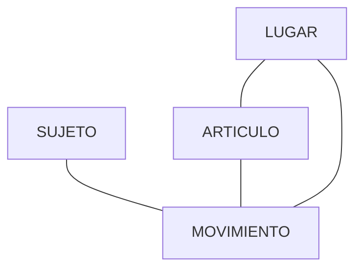
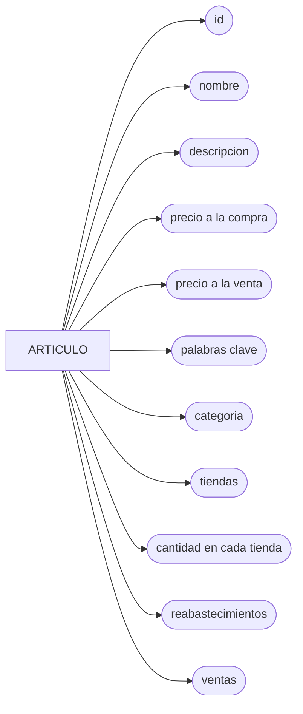

# Carga de datos en la base de datos distribuida de una cadena de tiendas de abarrotes. (Documentación)

En este repositorio se concentraran todos los documentos de los distintos sistemas (unicamente documentacion, no codigo, la documentación puede incluir trozos de codigo indispensables para el entendimiento de esta).

## ¿De que va el proyecto?
Se realizará el diseño de un sistema de información ERP (Enterprise Resource Planning) de una cadena de tienda de abarrotes. Crear el modelo lógico y físico de bases de datos distribuidas.

## ¿Cómo funciona una cadena de tienda de abarrotes?

Las tiendas de abarrotes son pequeños o medianos negocios que ofrecen una gran variedad de productos de primera necesidad; desde alimentos hasta productos de limpieza, e incluso, hay algunas que tienen disponibilidad de productos de salchichonería y bebidas alcohólicas1.

Colocandonos en el contexto proporcionado por el proyecto 
>El sistema es un ERP de una empresa de tiendas de abarrotes la cual tiene 4 sucursalesen la ciudad (Sucursal Lerma, Zinacantepec, Toluca centro y Metepec). El desarrollo debe ser un sistema integral donde se incluyan todas las áreas y los procesos de negocio de la empresa (ventas, control de inventarios, entrega de productos, finanzas, facturación, recursos humanos). No necesariamente en alguna de las sucursales estarán las bases de datos 2

obtenemos una guia para nuestra investigación, principalmente enfocado a entender cual es el flujo de trabajo de una tienda de abarrotes.

Las partes fundamentales del proceso de negocio son el control de inventario, recursos humanos y finanzas, las cuales se analizaran aisladamente para posteriormente unificarlas.

## Inventario

 El inventario es el conjunto de artículos o materiales que un negocio tiene la intención de vender a los clientes con fines lucrativos. 

La gestión de inventario, un elemento crítico de la cadena de suministro, es el seguimiento del inventario desde el momento de su fabricación hasta los almacenes, y desde estas instalaciones hasta el punto de venta. 

El objetivo de la gestión de inventario es tener los productos correctos en el lugar adecuado y en el momento preciso. Esto requiere visibilidad de inventario: saber cuándo se debe hacer los pedidos, cuánto se debe pedir y dónde almacenar las existencias.

- Compra de inventario: los productos listos para la venta se compran y se entregan en el almacén o directamente en el punto de venta.
- Almacenamiento de inventario: el inventario se almacena hasta que se necesita. Los bienes o materiales se transfieren a través de su red, y hasta que estén listos para su envío.
- Beneficio del inventario: Se controla la cantidad de producto a la venta. Las mercancías acabadas son liberadas para tramitar los pedidos. Los productos son enviados a los clientes.

En el inventario se encunetran distintas entidades relacionadas, la principal es el `articulo`, puesto que es la manipulación de este en que giran las acciones de la empresa.

Este `articulo` sera almacenado ya sea en alguna o en todas las tiendas u almacenes, este podra ser vendido, trasladado, reabastecido o perdido, estas acciones las identificaremos como `movimientos`.

Cuando se realiza una `venta` se realizará una `factura`, ya sea a publico en general o a un cliente en especifico, debemos realizar un registro de cada venta, esta operacion es de ingreso.

Un `traslado` es llevado a cabo cuando por algún motivo es necesario mover uno o más articulos de una tienda a otra, o en su caso, de un almacen a otro, o de una almacen a una tienda, ya sea parcial o totalmente, aquí tendremos almenos un `empleado` encargado, esta operacion no representa ni un ingreso ni un egreso a la empresa.

Un `reabastecimiento` es la compra de `articulos` a un `proveedor`, este se realizará cuando se acerque a un minimo de cantidades de dichos articulos, esta representa un egreso.

Una `devolución` se realiza, como ya se mencionó arriba, cuando un usuario decide regresar el producto, aquí se le regresa el dinero del costo del producto devuelto, este producto podra regresar al inventario o desecharse.

Una `perdida` se da por dos motivos, que un producto se deba desechar, o, que un producto haya sido robado, esto representa perdidas para la empresa.

Diagrama de relaciones generales entre entidades.

Se procede a analizar individualmente cada entidad, con el fin de definir los atributos que cada una poseera, a ecepcion de los englobados en sujeto.

### Lugar 
Por `LUGAR` nos referimos a la sucursal y/o almacen (si se da el caso) en que se encuentra un producto.

---
### Articulo
 Nos interesa identificarlo, conocer su nombre, descripción, precio en que se compra, precio a la venta, palabras clave, categoria a la que pertenece, en qué tiendas/almacenes se encuentra y la cantidad que hay en cada uno, un registro de cuando se reabastece y un registro de cada venta de dicho producto.

---
### Movimientos
--- 
Es así 

## Recursos humanos
## Finanzas

Cada que se realiza una `venta` se actualiza la cantidad de productos en inventario, de cada `venta`, nos interesa conocer los articulos involucrados, así como la cantidad de cada uno, el total, la tienda en que se realizó la compra, la fecha, si el pago fue en efectivo, transferencia o con tarjeta, así como los datos del `cliente` y el `empleado` que la concretó.

Hay más momentos que pueden alterar al inventario, estos son `traslado` y la `reabastecimiento`, en el caso de `traslado` nos referimos cuando se deben redestribuir los articulos dentro de lugares propios de la empresa (almacen, tienda, etc), es decir cuando de la "tienda 1" se traslada "x" producto a la "tienda 2", en este movimiento nos interesa conocer los 
 

# ...

 obteniendo el siguiente diagrama conceptual:

## Referencias
1. [Crehana | Blog | Negocios | ¿Cómo poner una tienda de abarrotes](https://www.crehana.com/blog/negocios/como-poner-tienda-abarrotes/)
2. [Pablo Salas Castillo | Evaluación Practica](https://alumnouaemex.sharepoint.com/sites/BasedeDatosIICO02Semestre2023a/Materiales%20de%20clase/Evaluacion%20practica/Evaluacion2023a_Co02.pdf?CT=1680902754832&OR=ItemsView)
3. 