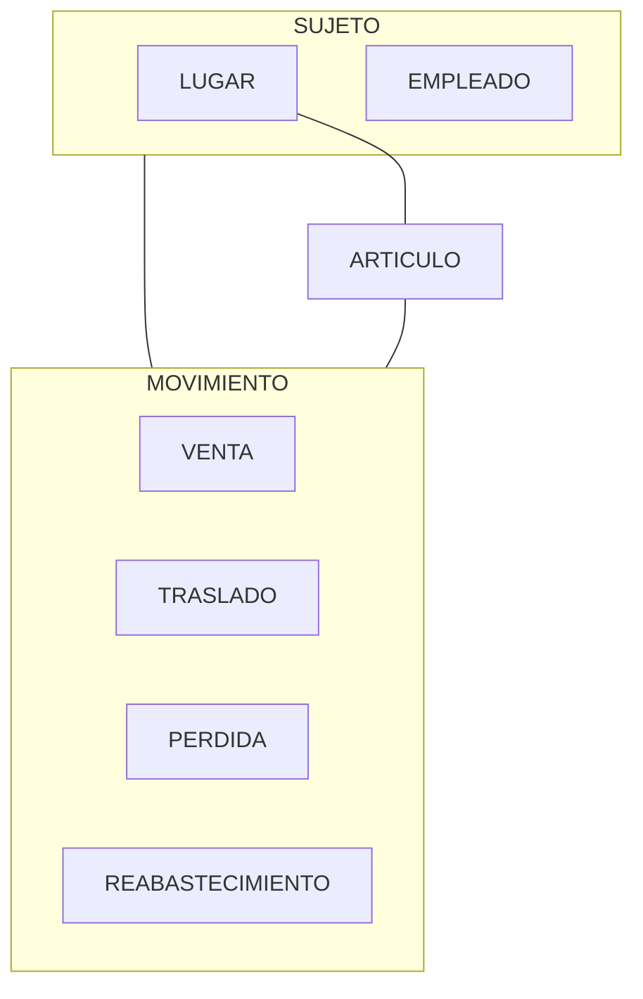
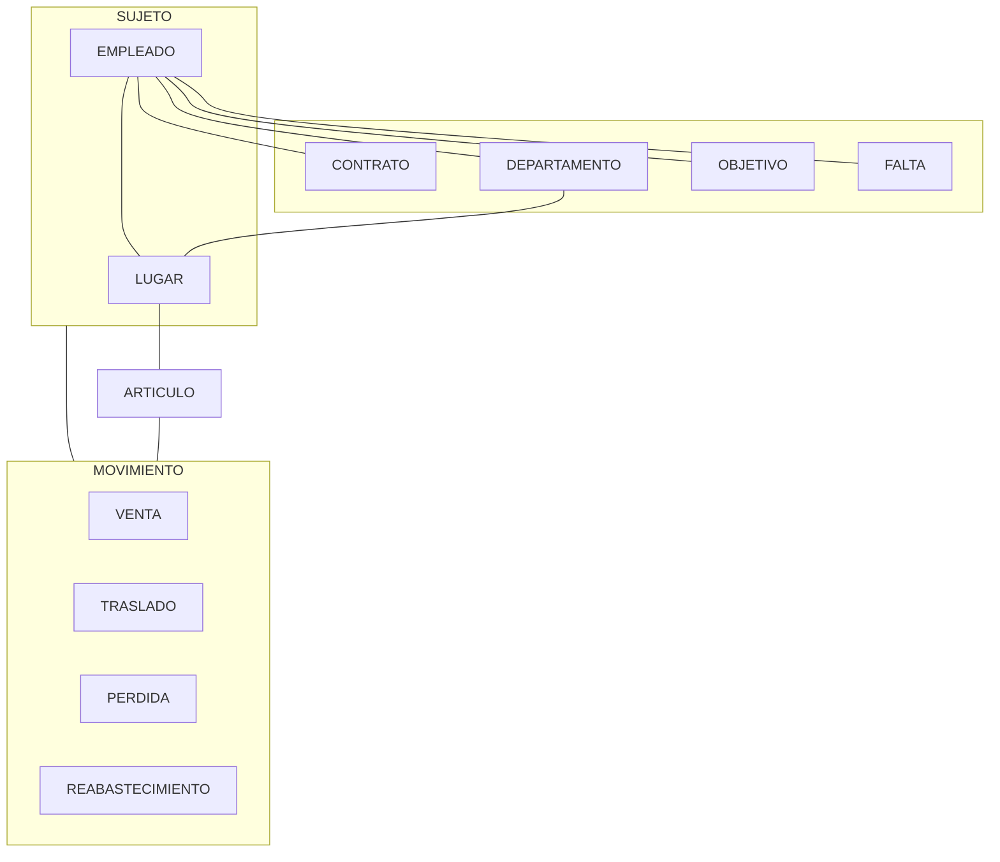

# Carga de datos en la base de datos distribuida de una cadena de tiendas de abarrotes. (Documentación)

En este repositorio se concentraran todos los documentos de los distintos sistemas (unicamente documentacion, no codigo, la documentación puede incluir trozos de codigo indispensables para el entendimiento de esta).

## ¿De que va el proyecto?
Se realizará el diseño de un sistema de información ERP (Enterprise Resource Planning) de una cadena de tienda de abarrotes. Crear el modelo lógico y físico de bases de datos distribuidas.

## ¿Cómo funciona una cadena de tienda de abarrotes?

Las tiendas de abarrotes son pequeños o medianos negocios que ofrecen una gran variedad de productos de primera necesidad; desde alimentos hasta productos de limpieza, e incluso, hay algunas que tienen disponibilidad de productos de salchichonería y bebidas alcohólicas1.

Colocandonos en el contexto proporcionado por el proyecto 
>El sistema es un ERP de una empresa de tiendas de abarrotes la cual tiene 4 sucursalesen la ciudad (Sucursal Lerma, Zinacantepec, Toluca centro y Metepec). El desarrollo debe ser un sistema integral donde se incluyan todas las áreas y los procesos de negocio de la empresa (ventas, control de inventarios, entrega de productos, finanzas, facturación, recursos humanos). No necesariamente en alguna de las sucursales estarán las bases de datos 2

obtenemos una guia para nuestra investigación, principalmente enfocado a entender cual es el flujo de trabajo de una tienda de abarrotes.
## Analisis por area de la empresa.
Las partes fundamentales del proceso de negocio son el control de inventario, recursos humanos y finanzas, las cuales se analizaran con el fin de identificar las entidades de la base de datos.
### Inventario

El inventario es el conjunto de artículos o materiales que un negocio tiene la intención de vender a los clientes con fines lucrativos. 

La gestión de inventario, un elemento crítico de la cadena de suministro, es el seguimiento del inventario desde el momento de su fabricación hasta los almacenes, y desde estas instalaciones hasta el punto de venta. 

¿Cuáles son los tipos de gestión de inventario?
Gestión periódica de inventarios
El sistema periódico de inventarios es un método de valoración que se utiliza para los informes financieros en el que se realiza un recuento físico del inventario a intervalos específicos. Este método contable toma el inventario al comienzo de un período, agrega nuevas compras de inventario durante el período y deduce el inventario final para derivar el costo de los bienes vendidos (COGS).

Gestión de inventario de códigos de barras
Las empresas utilizan sistemas de gestión de inventario de códigos de barras para asignar un número a cada producto que venden. Pueden asociar varios puntos de datos al número, incluido el proveedor, las dimensiones del producto, el peso e incluso datos variables, como saber cuántos hay disponibles.

Gestión de inventario RFID
La identificación por radiofrecuencia o RFID es un sistema que transmite de forma inalámbrica la identidad de un producto en forma de un número de serie único para rastrear artículos y proporcionar información detallada del mismo. El sistema de gestión de almacenes basado en RFID puede mejorar la eficiencia, aumentar la visibilidad del inventario y garantizar un registro automático rápido para la recepción y la entrega.3

Dado que las ventas de la empresa son de productos previamente adquiridos, es decir no son producidos por esta misma, la mejor opcion es utilizar la gestión de inventario de código de barras.

El objetivo de la gestión de inventario es tener los productos correctos en el lugar adecuado y en el momento preciso. Esto requiere visibilidad de inventario: saber cuándo se debe hacer los pedidos, cuánto se debe pedir y dónde almacenar las existencias.

- Compra de inventario: los productos listos para la venta se compran y se entregan en el almacén o directamente en el punto de venta.
- Almacenamiento de inventario: el inventario se almacena hasta que se necesita. Los bienes o materiales se transfieren a través de su red, y hasta que estén listos para su envío.
- Beneficio del inventario: Se controla la cantidad de producto a la venta. Las mercancías acabadas son liberadas para tramitar los pedidos. Los productos son enviados a los clientes.3

En el inventario se encunetran distintas entidades relacionadas, la principal es el `ARTICULO`, puesto que es la manipulación de este en que giran las acciones de la empresa.

Este `ARTICULO` estará en el `INVENTARIO` ya sea en alguna o en todas las tiendas u almacenes, este podra ser afectado por una `VENTA`, un `TRASLADO`, una `PERDIDA` o un `REABASTECIMIENTO`, estas acciones las identificaremos como `MOVIMIENTO` dado que comparten información que será detallada más adelante.

`LUGAR` es una  entidad que comparte informacion en común con otras, por lo que nombraremos a una entidad padre `SUJETO`

Diagrama conceptual parcial tomando en cuenta las entidades involucradas en la gestíon de inventario.

### Recursos Humanos
El departamento de recursos humanos es quien debe velar y promover un buen ambiente laboral que impulse a la organización a mejorar su eficiencia y efectividad. Es el área responsable de representar y transmitir la cultura empresarial y sus valores al resto de empleados para conseguir, a través de una buena gestión, que los objetivos empresariales y los objetivos de los trabajadores vayan de la mano.

Funciones :
1. Planificacion y selección del personal
2. Administración del personal
3. Evaluación y desarrollo

Por lo que para la implementacion del proyecto en esta erea, consideeramos:

Cada `EMPLEADO` es contratado mediante un `CONTRATO`, cada `EMPLEADO` pertenece a un `LUGAR` o a un `DEPARTAMENTO`, este `EMPLEADO` tendrá `OBJETIVO`s, así cómo tambien puede incurrir en una `FALTA`, tambien, el `EMPLEADO`registra su `ASISTENCIA` cada `DEPARTAMENTO` tiene un gerente, y cada `LUGAR` tiene un encargado, que igualmente es `EMPLEADO`.
Cada `DEPARTAMENTO` se ubica en un `LUGAR`.

El empleado tiene atributos propios de `SUJETO`, por esto los heredará. 

Diagrama conceptual parcial tomando en cuenta las entidades involucradas en la gestíon de inventario y recursos humanos.
### Finanzas
El departamento de finanzas es la parte que se encarga de llevar las finanzas de la organización. Con esto nos referimos a todas las responsabilidades económicas de ella. No obstante, aunque en lineamientos generales la función preponderante de este sector tenga esta responsabilidad, su alcance son mucho más que esto es sí.

La principal función que tiene el departamento de finanzas es la de realizar las cancelaciones de las obligaciones económicas de la empresa. Como así también la de gestionar las partidas de ingresos y gastos que pueda tener la compañía.6

Las funciones del departamento de finanzas son:
- Consultoría y analisis de presupuestos
- Estructurar de forma conveniente los planes financieros
- Pago de salario de los trabajadores
- Análisis de las problemáticas financieras

No se toma en cuenta lo de entrega de productos, puesto que toda venta se dará en mostrador.

#### Ingresos
Los ingresos de la empresa proviene unicamente de la `VENTA`. 

Cuando se realiza una `VENTA` se realiza una `FACTURA`, ya sea a publico en general o a un `CLIENTE` (Entidad hija de SUJETO) en especifico y un `EMPLEADO` la lleva a cabo en determinado`LUGAR`, en una venta hay uno o más `ARTICULO`s.

#### Gastos
Los gastos de la empresa provienen de distintas fuentes, entre ellas:
- Reabastecimiento
- Movimiento de mercancia (TRASLADO)
- Pago de servicios (Agua, luz)
- Nominas
- Seguro
- Afore
- Pago de impuestos
- Prima vacacional
- Renta

Un `REABASTECIMIENTO` es la compra de `ARTICULOS` a un `PROVEEDOR`, este se realizará cuando se acerque a un minimo de cantidades de dichos articulos, estos `ARTICULOS`adquiridos son almacenados en un `LUGAR`.

Un `TRASLADO` es llevado a cabo cuando por algún motivo es necesario mover uno o más `ARTICULO`s de una tienda a otra, o en su caso, de un almacen a otro, o de una almacen a una tienda, ya sea parcial o totalmente, aquí tendremos almenos un `EMPLEADO` encargado, el costo de este traslado es por traslado y no por articulo.

Cada `LUGAR` tiene que pagar `SERVICIOS` como lo es el agua, luz, entre otras cosas al igual que `RENTA`, estas dos unidades se unifican en una llamada `GASTOS LUGAR`.

A cada `EMPLEADO` se le debe pagar la `NOMINA` quincenalmente, por cada `EMPLEADO` se debe pagar lo correspondiente al `SEGURO` y del `AFORE`.

Cada que un `EMPLEADO` pida `VACACIONES` se realizará el pago correspondiente de su `PRIMA VACACIONAL`

De `NOMINA`, `SEGURO`, `AFORE` y `PRIMA VACACIONAL` se pueden unificar en una sola entidad nombrada `GASTOS_EMPLEADO`puesto que tienen la misma información, id de empleado, monto, fecha, etc.
#### Perdidas
Las `PERDIDA`s se dan por dos cosas, que el `ARTICULO` se haya hechado a perder, o que un `LUGAR` haya sufrido un robo

## Referencias
1. [Crehana | Blog | Negocios | ¿Cómo poner una tienda de abarrotes](https://www.crehana.com/blog/negocios/como-poner-tienda-abarrotes/)
2. [Pablo Salas Castillo | Evaluación Practica](https://alumnouaemex.sharepoint.com/sites/BasedeDatosIICO02Semestre2023a/Materiales%20de%20clase/Evaluacion%20practica/Evaluacion2023a_Co02.pdf?CT=1680902754832&OR=ItemsView)
3. [IBM | ¿Qué es la gestión de inventario?](https://www.ibm.com/mx-es/topics/inventory-management)
4. [SAT | Anexo 20 guia de los comprobantes fiscales digitales por internet](http://omawww.sat.gob.mx/tramitesyservicios/Paginas/documentos/Anexo_20_Guia_de_llenado_CFDI.pdf)
5. [GS1 Mexico | ¿Qué es el GTIN y para qué sirve?](https://blog.gs1mexico.org/que-es-codigo-gtin-para-que-sirve)
